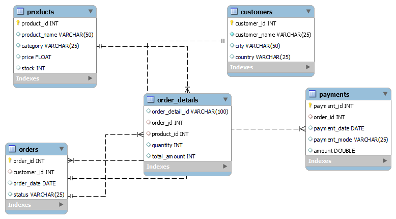

<h1 align="center">🛒 Sales Management System (SQL Project)</h1>

  A complete MySQL-based Sales Management Database Project  
  <b>By: Varsha Maurya</b>

<h2>📘 Overview</h2>

The <b>Sales Management System</b> is a relational database project built using <b>MySQL</b>.
It helps manage <b>customers, products, orders, payments, and order details</b> efficiently.
The project demonstrates key <b>SQL concepts</b> such as:
<ul>
  <li>Table creation with constraints</li>
  <li>Primary and foreign keys</li>
  <li>Data insertion</li>
  <li>Joins and aggregations</li>
  <li>Subqueries and filtering</li>
</ul>

<h2>🧩 ER Diagram</h2>

  The Entity Relationship Diagram (ERD) shows how all tables are connected.

  

<h2>🗂️ Database Schema</h2>

<h3>1️⃣ Customers Table</h3>
<table>
<tr><th>Column</th><th>Type</th><th>Description</th></tr>
<tr><td>customer_id</td><td>INT (PK)</td><td>Unique customer ID</td></tr>
<tr><td>customer_name</td><td>VARCHAR(25)</td><td>Customer name</td></tr>
<tr><td>city</td><td>VARCHAR(50)</td><td>Customer city</td></tr>
<tr><td>country</td><td>VARCHAR(25)</td><td>Customer country</td></tr>
</table>

<h3>2️⃣ Products Table</h3>
<table>
<tr><th>Column</th><th>Type</th><th>Description</th></tr>
<tr><td>product_id</td><td>INT (PK)</td><td>Unique product ID</td></tr>
<tr><td>product_name</td><td>VARCHAR(50)</td><td>Product name</td></tr>
<tr><td>category</td><td>VARCHAR(25)</td><td>Product category</td></tr>
<tr><td>price</td><td>FLOAT</td><td>Product price</td></tr>
<tr><td>stock</td><td>INT</td><td>Available stock</td></tr>
</table>

<h3>3️⃣ Orders Table</h3>
<table>
<tr><th>Column</th><th>Type</th><th>Description</th></tr>
<tr><td>order_id</td><td>INT (PK)</td><td>Unique order ID</td></tr>
<tr><td>customer_id</td><td>INT (FK)</td><td>Linked to customers table</td></tr>
<tr><td>order_date</td><td>DATE</td><td>Date of order</td></tr>
<tr><td>status</td><td>VARCHAR(25)</td><td>Order status</td></tr>
</table>

<h3>4️⃣ Order_Details Table</h3>
<table>
<tr><th>Column</th><th>Type</th><th>Description</th></tr>
<tr><td>order_detail_id</td><td>VARCHAR(100)</td><td>Unique detail ID</td></tr>
<tr><td>order_id</td><td>INT (FK)</td><td>Linked to orders table</td></tr>
<tr><td>product_id</td><td>INT (FK)</td><td>Linked to products table</td></tr>
<tr><td>quantity</td><td>INT</td><td>Quantity ordered</td></tr>
<tr><td>total_amount</td><td>INT</td><td>Total price for the order</td></tr>
</table>

<h3>5️⃣ Payments Table</h3>
<table>
<tr><th>Column</th><th>Type</th><th>Description</th></tr>
<tr><td>payment_id</td><td>INT (PK)</td><td>Unique payment ID</td></tr>
<tr><td>order_id</td><td>INT (FK)</td><td>Linked to orders table</td></tr>
<tr><td>payment_date</td><td>DATE</td><td>Payment date</td></tr>
<tr><td>payment_mode</td><td>VARCHAR(25)</td><td>Payment method</td></tr>
<tr><td>amount</td><td>FLOAT</td><td>Payment amount</td></tr>
</table>

<h2>📊 Sample SQL Queries</h2>

<h3>🔹 1. Display all customers</h3>
<pre><code>SELECT * FROM customers;</code></pre>

<h3>🔹 2. List all orders placed in October 2025</h3>
<pre><code>SELECT * FROM orders
WHERE order_date BETWEEN '2025-10-01' AND '2025-10-31';</code></pre>

<h3>🔹 3. Show all orders with customer names</h3>
<pre><code>SELECT c.customer_name, o.order_id, o.order_date, o.status
FROM customers AS c
INNER JOIN orders AS o
ON c.customer_id = o.customer_id;</code></pre>

<h3>🔹 4. Find total sales for each product</h3>
<pre><code>SELECT p.product_name, SUM(od.total_amount) AS total_revenue
FROM products AS p
INNER JOIN order_details AS od ON p.product_id = od.product_id
GROUP BY p.product_name;</code></pre>

<h3>🔹 5. Display customers who made payments greater than ₹50,000</h3>
<pre><code>SELECT customer_name
FROM customers
WHERE customer_id IN (
    SELECT o.customer_id
    FROM orders AS o
    INNER JOIN payments AS p ON o.order_id = p.order_id
    GROUP BY o.customer_id
    HAVING SUM(p.amount) > 50000
);
</code></pre>

<h2>🚀 How to Run the Project</h2>
<ol>
  <li>Clone this repository: 
    <pre><code>git clone https://github.com/&lt;your-username&gt;/SalesManagementSystem.git</code></pre>
  </li>
  <li>Open MySQL Workbench and create the database.</li>
  <li>Run <b>SalesManagement.sql</b> to create tables and insert data.</li>
  <li>Open <b>queries.sql</b> to test your SQL commands.</li>
  <li>View <b>ER_Diagram_SalesManagement.png</b> for the schema design.</li>
</ol>

<h2>🏆 Learning Outcomes</h2>
<ul>
  <li>Database design with relationships</li>
  <li>Using foreign keys and normalization</li>
  <li>Executing joins, subqueries, and aggregations</li>
  <li>Real-world business data analysis</li>
</ul>

<h2>👩‍💻 Author</h2>

<b>Varsha Maurya</b>  
📧 <a href="mailto:varshamaurya@gmail.com">varshamaurya@gmail.com</a>  
🔗 <a href="https://www.linkedin.com/in/varshamaurya600/">LinkedIn Profile</a>

